JPL D-104255
EMIT DRL XXX
ATBD-EMIT-02a

# Earth surface Mineral dust source InvesTigation (EMIT)

## EMIT L2A Algorithm: Surface Reflectance and Scene Content Masks

### Theoretical Basis

David R. Thompson1, Philip G. Brodrick1, Robert O. Green1, Olga Kalashnikova1, Sarah Lundeen1, Gregory Okin2, Winston Olson-Duvall1, Thomas Painter2

1 Jet Propulsion Laboratory, California Institute of Technology

2 University of California, Los Angeles

Version 2.0
July 2026

Jet Propulsion Laboratory
California Institute of Technology
Pasadena, California 91109-8099

---

## Change Log

| Version | Date | Comments |
|---------|------|----------|
| 0.1 | Sept. 15, 2019 | Initial Draft |
| 0.2 | Sept. 29, 2019 | Candidate Science Peer Review Version |
| 0.3 | Dec. 6, 2019 | Science Team Meeting at the Jet Propulsion Laboratory |
| 0.4 | Dec. 17, 2019 | Changes attending to peer review and NASA template |
| 0.5 | Jan 2, 2020 | Changes post-PDR |
| 0.6 | Jan 25, 2020 | Added output products |
| 0.7 | Jan 30, 2020 | Cloud mask dilation |
| 0.8 | Apr 7, 2020 | Code repository |
| 0.9 | Apr 8, 2020 | Input and output are no longer orthorectified |
| 1.0 | Apr 10, 2020 | Pre-CDR Science Peer Review. Title Change. |
| 1.1 | May 21, 2020 | Spacecraft Mask |
| 1.2 | June 16, 2020 | Fixed a vestigial orthorectification reference |
| 1.3 | Dec. 15, 2020 | Cirrus Mask |
| 1.4 | Jan 31, 2022 | sRTMNet |
| 1.5 | September, 2024 | Analytical Line |
| 2.0 | September, 2026 |  |

---

## Table of Contents

1. [Key Team Members](#1-key-team-members)
2. [The EMIT Mission and its Instrumentation](#2-the-emit-mission-and-its-instrumentation)
3. [EMIT Level 2A Algorithm](#3-emit-level2a-algorithm)
   - 3.1 [Introduction](#31-introduction)
   - 3.2 [Input data](#32-input-data)
   - 3.3 [The atmospheric correction algorithm](#33-the-atmospheric-correction-algorithm)
     - 3.3.1 [Radiative Transfer and Atmospheric Modeling](#421-radiative-transfer-and-atmospheric-modeling)
     - 3.3.2 [Superpixel Segmentation](#332-superpixel-segmentation)
     - 3.3.3 [OE Model Inversion](#333-oe-model-inversion)
     - 3.3.4 [Analytical Line extrapolation](#334-analytical-line-extrapolation)
     - 3.3.5 [Data Masks](#335-data-masks)
   - 3.4 [Practical Considerations](#43-practical-considerations)
4. [Output Data](#5-output-data)
5. [Calibration, Validation, and Field Measurement](#5-calibration-validation-and-field-measurement)
6. [Constraints and Limitations](#6-constraints-and-limitations)
7. [Code Repository and References](#7-code-repository-and-references)
   - 7.1 [Repository](#71-repository)
   - 7.2 [References](#72-references)

---

## 1. Key Team Members

A large number of individuals contributed to the development of the algorithms, methods, and implementation of the L1b approach for EMIT. The primary contributors are the following:

- **David R. Thompson** (Jet Propulsion Laboratory) – EMIT Co-I, Instrument Scientist
- **Robert O. Green** (Jet Propulsion Laboratory) – Mission PI, Radiometric modeling
- **Tom Painter** (Jet Propulsion Laboratory) – Surface reflectance and BRDF
- **Olga Kalashnikova** (Jet Propulsion Laboratory) – Atmospheric Aerosols
- **Sarah Lundeen** (Jet Propulsion Laboratory) – Science Data System Lead
- **Randy Pollock** (Jet Propulsion Laboratory) – Instrument Systems Engineer
- **Philip Brodrick** (Jet Propulsion Laboratory) – Algorithms Design and Implementation

In addition, the algorithms described are based on prior work that includes sponsorship by multiple research agencies and includes contributions by many individuals. These are associated with the papers and manuscripts listed throughout this text, and provided in references under the relevant topics.

---

## 2. The EMIT Mission and its Instrumentation

Mineral dust radiative forcing is the single largest uncertainty in aerosol direct radiative forcing (USGCRP and IPCC). Mineral dust is a principal contributor to direct radiative forcing over arid regions, impacting agriculture, precipitation, and desert encroachment around the globe. However, we have poor understanding of this effect due to uncertainties in the dust composition. Dust radiative forcing is highly dependent on its mineral-specific absorption properties, and the current range of iron oxide abundance in dust source models (0 – 7 wt%) translates into a 460% uncertainty in regional radiative forcing predicted by Earth System Models (ESMs). Meanwhile, soil samples from North Africa regions – important sources of mineral dust – contain up to 30 wt% iron oxide. The National Aeronautics and Space Administration (NASA) recently selected the Earth Surface Mineral Dust Source Investigation (EMIT) to close this knowledge gap. EMIT will launch an instrument to the International Space Station (ISS) to directly measure and map the mineral composition of critical dust-forming regions worldwide.

The EMIT Mission will use imaging spectroscopy across the visible shortwave (VSWIR) range to reveal distinctive mineral signatures, enabling rigorous mineral detection, quantification, and mapping. The overall investigation aims to achieve two objectives.

1. **Constrain the sign and magnitude of dust-related RF at regional and global scales.** EMIT achieves this objective by acquiring, validating and delivering updates of surface mineralogy used to initialize ESMs.
2. **Predict the increase or decrease of available dust sources under future climate scenarios.** EMIT achieves this objective by initializing ESM forecast models with the mineralogy of soils exposed within at-risk lands bordering arid dust source regions.

The EMIT instrument is a Dyson imaging spectrometer that will resolve the distinct absorption features of iron oxides, clays, sulfates, carbonates, and other dust-forming minerals with contiguous spectroscopic measurements in the visible to short wavelength infrared region of the spectrum. EMIT will map mineralogy with a spatial sampling to detect minerals at the one hectare scale and coarser, ensuring accurate characterization the mineralogy at the grid scale required by ESMs. EMIT's fine spatial sampling will resolves the soil exposed within hectare-scale agricultural plots and open lands of bordering arid regions, critical to understanding feedbacks caused by mineral dust arising from future changes in land use, land cover, precipitation, and regional climate forcing.

| Data Product | Description | Initial Availability | Median Latency Post-delivery | NASA DAAC |
|--------------|-------------|----------------------|------------------------------|-----------|
| Level 0 | Raw collected telemetry | 4 months after IOC | 2 months | LP DAAC |
| Level 1a | Reconstructed, depacketized, uncompressed data, time referenced, annotated with ancillary information reassembled into scenes. | 4 months after IOC | 2 months | LP DAAC |
| Level 1b | Level 1a data processed to sensor units including geolocation and observation geometry information | 4 months after IOC | 2 months | LP DAAC |
| Level 2a | Surface reflectance derived by screening clouds and correction for atmospheric effects. | 8 months after IOC | 2 months | LP DAAC |
| Level 2b | Mineralogy derived from fitting reflectance spectra, screening for non-mineralogical components. | 8 months after IOC | 2 months | LP DAAC |
| Level 3 | Gridded map of mineral composition aggregated from level 2b with uncertainties and quality flags | 11 months after IOC | 2 months | LP DAAC |
| Level 4 | Earth System Model runs to address science objectives | 16 months after IOC | 2 months | LP DAAC |

*Table 1: EMIT Data Product Hierarchy*

The EMIT Project is part of the Earth Venture-Instrument (EV-I) Program directed by the Program Director of the NASA Earth Science Division (ESD). EMIT is comprised of a Visible/Shortwave Infrared Dyson imaging spectrometer adapted for installation on the International Space Station (ISS). It will be installed on Flight Releasable Attachment Mechanism (FRAM) of an ExPRESS Logistics Carrier (ELC) on the ISS, in a site formally designated ELC 1 FRAM 8. NASA has assigned management of the Project to the Jet Propulsion Laboratory of the California Institute of Technology. The EMIT Payload is scheduled to be installed on the ELC 1 FRAM 8 in 2021. Table 1 above describes the different data products to which the EMIT Mission will provide to data archives. This document describes the "Level 2A" stage.

    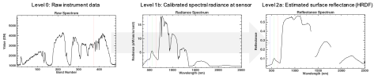

*Figure 1: Representative spectra from the EMIT analysis, data product levels 0, 1b, and 2a. (Level 0: Raw instrument data; Level 1b: Calibrated spectral radiance at sensor; Level 2a: Estimated surface reflectance (HRDF).)*

    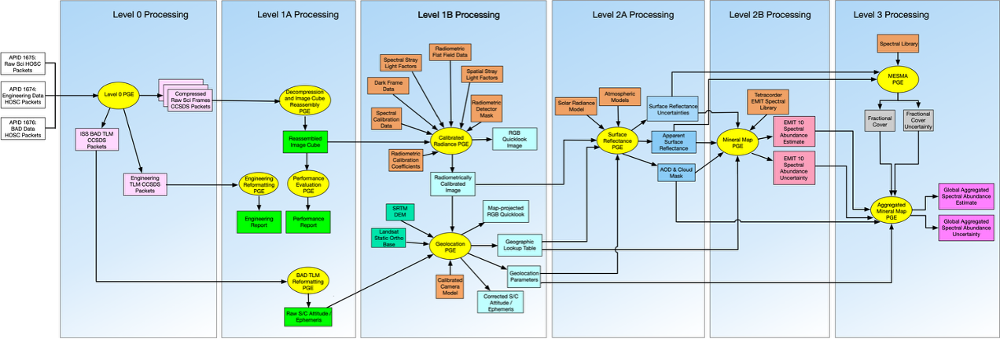

*Figure 2. High-level workflow of the EMIT science data system.*

This document describes the theoretical basis for the algorithm producing EMIT's "Level 2a" product. Figure 1 shows examples of the spectrally-defined quantities leading up to this analysis, drawn from an airborne precursor analogue instrument. Figure 2 is a diagram of the Science Data System workflow, including all analysis stages and dependencies. The system begins with a "Level 0" raw data product that records the raw sensor output in digital numbers. The EMIT Science Data System (SDS) applies spectral and radiometric calibration to produce "Level 1" products, e.g. calibrated radiance measurements at the sensor. These are then geolocalized to produce an image that aligns with specific geographic coordinates for matching against digital elevation models. The "Level 2A" inverts these radiance measurements. It uses physically-motivated surface/atmosphere models to estimate atmospheric properties and surface reflectance. The "Level 2A" products include atmospheric parameters and other ancillary files, but the primary output is the surface reflectance estimate used for later analysis by mineral detection and mapping algorithms. The mineral detection stage (not shown) performs feature fitting on the reflectance data to estimate mineral occurrence, creating a "Level 2B" map at native instrument resolution. This is aggregated into a coarse "Level 3" product for incorporation into Earth System modeling to evaluate Radiative Forcing (RF) impacts. All stages are instantiated in the EMIT science product generation software operating at the Jet Propulsion Laboratory, California Institute of Technology.

---

## 3. EMIT Level 2A Algorithm
### 3.1 Introduction

Level 2A processing is the Atmospheric correction (AC) stage of EMIT data processing. Through a multi-decadal history of use, AC algorithms for earth-viewing imaging spectrometers have evolved throughout the lifetimes of airborne EMIT precursor instruments including NASA's "Classic" Airborne Visible Infrared Imaging Spectrometer (AVIRIS-C, Green et al., 1998), its next generation counterpart (AVIRIS-NG, Thompson et al., 2017), and EMIT's airborne copy (AVIRIS-3, Green et al., 2022). Across instrument generation, AC is a critical component of data processing and product delivery for dozens of campaigns over decades of successful operation. Algorithm selection is a key consideration. Empirical AC algorithms like those based on scene averaging (Kruse 1988), flat fielding (Roberts et al., 1986), QUAC (Bernstein et al., 2005), and cloud shadow methods (Reinersman et al., 1998) are useful but do not scale to global observations with diverse scene content and sparse field calibration-validation data. AC methods that rely on manual intervention, on specific characteristics of the scene such as a spatially homogeneous atmosphere, or on known scene content preclude their use with EMIT. which must provide accurate atmospherically corrected surface reflectance across all environments included within the target mask. To accomodate the required generalizability, we favor a physically-motivated correction based on radiative transfer models. Physical basis has the dual advantages of superior generalizability across scenes without the need for manual intervention in the analysis, and physical interpretability.

Reviews surveying different physically-based atmospheric correction alternatives appear in Thompson et al. (2019), Ientilucci and Adler-Golden (2019), and for aquatic spectra, Frouin et al. (2019). Physically-based methods fall into two general categories, sequential and simultaneous methods (Frouin et al., 2019). Sequential methods first estimate atmospheric properties based on analysis of the radiance spectrum, and then invert the radiance directly to estimate the surface reflectance via closed-form algebra. In other words, atmosphere and surface are estimated in two independent steps. Existing physics-based atmospheric correction codes designed for imaging spectrometers all use this general method. They include ACORN (Kruse et al., 2004), ATCOR (Richter and Shlaepferm 2002), ATREM (Gao, 1993) and the AVIRIS-NG standard approach derived from ATREM (Thompson et al., 2015). The alternative, simultaneous methods, estimate surface, atmosphere, and instrument effects simultaneously, as in Bayesian Maximum A Posteriori estimation (Thompson et al., 2018, 2019b). 

Simultaneous methods carry several advantages that are crucial for the EMIT mission. First, they enable rigorous uncertainty accounting. On the input side, uncertainty is propogated reflecting instrument noise in the radiance data which often varies by surface type, observing conditions, and wavelength. Additionally, background knowledge available in the form of multivariate statistical priors, which can be incorporated to futher quantify the uncertatiny in surface reflectance solution with respect to our statistical expectation of the surface type. On the output side, uncertainty accounting lets the algorithm propagate posterior uncertainty estimates downstream, where they can improve the performance of mineral fitting algorithms (Thompson et al., 2020b). The second benefit of simultaneous methods is that calibration factors addressing regions of the spectrum with known systematic error can be directly included alongside surface and atmospheric variables in the joint solution. The third benefit of the simultaneous model inversion approach is the demonstrated ability to use the entire spectral range of acquisition in the atmospheric correction, enabling estimation of subtler broad atmospheric perturbations such as aerosols (an EMIT product, in the form of an AOD mask). The ability to seamlessly account for these factors makes the Bayesian inversion a flexible and powerful approach to achieve EMIT's extreme sensitivity requirement at the cost of higher computational demands.

The EMIT mission uses a Bayesian model inversion strategy, a formalism known colloquially in the community as Optimal Estimation (OE, e.g. Rodgers 2000), with careful application of geospatial interpolation to minimize computational cost. The specific OE-based approach used in EMIT has been validated by decades of operational use by NASA's atmospheric remote sounding spectrometers on many missions and millions of acquisitions (e.g. Thompson et al., 2023, Cardoso et al., 2025, Brodrick et al., 2026). The approach has been validated though peer-reviewed field studies with over 20 in situ validation trials of surface reflectance over synthetic, water, vegetated, and bare terrain (Thompson et al., 2018, Thompson et al., 2019b, Thompson et al., 2019c, Thompson et al., 2020). Outside the imaging spectroscopy community, the OE approach has been used for In situ measurement protocols vetted by decades of continuing operational use (Thompson et al., 2015). OE atmospheric correciton software is distributed as open source through the public repository at https://github.com/isofit/isofit/. This transparency helps for finding errors, and also for end users who desire details on the implementation specifics (e.g. data layout in memory, command flow, etc.). The code has undergone continuing development by a growing community of users throughout the EMIT mission.

---

### 3.2 Input data

While the EMIT data products delivered to the DAAC follow DAAC formatting conventions, the Level 2A AC pipeline operates internally on data products stored as binary data cubes with detached human-readable ASCII header files. The precise formatting convention adheres to the ENVI standard, accessible (Jul 2026) at https://www.nv5geospatialsoftware.com/docs/ENVIHeaderFiles.html. The header files all consist of data fields in equals-sign-separated pairs, and describe the layout of the file. The specific input files needed for the L2b stage are:

**I. An observation metadata file**, typically with the string "obs" in the filename, containing information about the observation geometry for every pixel. The observation file uses the original instrument frame (non-orthorectified) coordinate system with size [rows x cols x 12] in Band-Interleaved by Line (BIL) format and single-precision IEEE little-endian floating point representation. It should overlay the radiance data exactly so that all of the pixels are associated between the two files. The channels contain:

1. Path length – the direct geometric distance from the sensor to the location on the surface of the Earth, as defined by a Digital elevation model
2. To-sensor azimuth, in decimal degrees, at the surface
3. To-sensor zenith, in decimal degrees, at the surface
4. To-sun azimuth, in decimal degrees, at the surface
5. To-sun zenith, in decimal degrees, at the surface,
6. Phase angle in degrees, representing the angular difference between incident and observation rays
7. Terrain slope in degrees as determined from DEMs,
8. Terrain aspect in degrees, as determined from DEMs,
9. The cosine of the solar incidence angle relative to the surface normal
10. UTC time

**II. A location file**, typically with the string "loc" in the filename, containing information about the geographic projection of each spectrum. The location file is left in the original non-orthorectified instrument coordinate system, with size [rows x cols x 3] in Band-Interleaved by Line (BIL) format and single-precision IEEE little-endian floating point representation. It should overlay the radiance data exactly. The channels contain:

1. Latitude of surface, in decimal degrees, with a WGS-84 datum
2. Longitude of surface, in decimal degrees, in degrees East of zero, with a WGS-84 datum
3. The average elevation of the surface, as determined from a Digital Elevation Model

**III. A geographic lookup table file**, typically with the string "glt" in the filename, containing information about the index into the unorthorectified data of each spectrum. It is projected to a geographic coordinate system, with size [rows x cols x 2] in Band-Interleaved by Line (BIL) format and 32-bit unsigned integer representation. Its columns contain the row and column indices, respectively, of each spectrum in the original unorthorectified data.

**IV. Radiance data at sensor**, typically with the string "rdn" in the filename, in units of uW /cm2/ nm / sr. The data is in the instrument frame (non-orthorectified representation with size [rows x cols x channels] in Band-Interleaved by Line (BIL) format and single-precision IEEE little-endian floating point representation. The precise number of channels is not yet determined at the time of this writing but should be a value close to 300.

"Bad data" at the periphery outside the field of view, or masked as a result of cloud masking or instrument error, is typically assigned the reserved (floating point) value -9999. In addition to these files above, which change on a per acquisition basis, the L2A stage uses a wide range of ancillary files in its configuration. These include configuration files themselves, climatology and physical reference data, surface, atmospheric, and instrument model data, and more. These ancillary files are outside the scope of this ATBD, where we will concern ourselves with the data associated with a particular product and acquisition. We will also disregard internal configurations used by the science data system for managing and running these processes. Table 2 Below enumerates all products.

| Input file | Format | Interpretation |
|------------|--------|----------------|
| Observation Metadata | rows x columns x 12, BIL interleave 32-bit floating point with detached ASCII header | Varies (see text) |
| Location File | rows x columns x 3, BIL interleave 32-bit floating point with detached ASCII header | Latitude in decimal degrees, Longitude in decimal degrees, elevation of surface in meters |
| Geographic Lookup Table | rows x columns x 2, BIL interleave 32-bit unsigned integer, detached ASCII header | Row and column index into unorthorectified instrument data |
| Radiance data | rows x columns x channels, BIL interleave 32-bit floating point with detached ASCII header | Radiance at sensor in uW /cm2/ nm / sr. |

*Table 2: Input files*

### 3.3 The atmospheric correction algorithm

EMIT atmospheric correction produces data cubes of calibrated, georectified surface reflectance, and atmospheric properties, both with accompanying per-channel uncertainty. The full algorithm is composed of a sequence of components, which together, orchestrate two stages of joint estimation for the surface, atmosphere, and instrument variables, heirin called the statevector. The two stages include first, a "superpixel" OE solution, which leverages the full iterative algorithm of Thompson et al. (2018). Second, the superpixel OE solution is used to produce a spatially smooth atmosphere following Eckert, et al. (2024) to inform an anlytical form of the OE formalism following Susiluoto et al. (2025) to directly calculate per-pixel surface reflectance and uncertainty.

Figure 3 below illustrates the sequence of operations along with the major input and output products at each stage. All procedures execute sequentially moving from top to bottom. Boxes are colored according to their designation as level 1B, level 2A, or intermediate products. Sub-sections of this document will describe each respective procedure.

    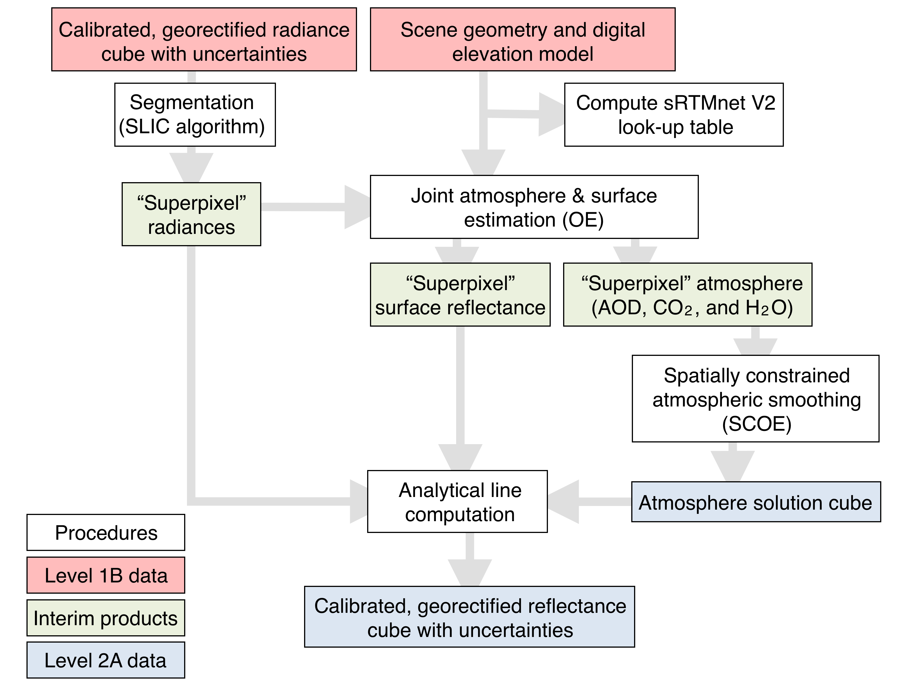

*Figure 3: Sequence of operations in the EMIT level 2A stage. All reflectance and atmosphere estimates also include uncertainty predictions. The workflow proceeds from the calibrated, georectified radiance cube (with uncertainties) and scene geometry / digital elevation model, superpixel segmentation (SLIC) yielding reference superpixel radiances, sRTMnet V2 LUT calculation, and atmosphere & surface estimation (OE) — producing reflectance estimates for reference superpixel spectra plus aerosol optical depths (AOD, CO2, and H2O). The atmosphere cube is spatially constrained following the SCOE algorithm (Eckert et al., 2024). With the fixed atmosphere, the analytical line algorithm then produces the calibrated, georectified reflectance cube with uncertainties.*

#### 3.3.1 Radiative Transfer and Atmospheric Modeling

Physics-based retrieval of atmospheric parameters and surface reflectance relies on mathematical models, also called forward models, expressing the spectral radiance recieved by the instrument at top-of-atmosphere as a sum of radiative terms from different processes experienced along photon paths. These include photon scattering by the atmosphere into the sensor line of sight, atmospheric gas absorption, and multiple scattering events between the atmosphere and the surface (Figure 4). Photon paths can be further decomposed into directional and diffuse fluxes from the sun, to the surface, and back to the sensor. These include direct-direct, direct-hemispherical, hemispherical-direct, and hemispherical-hemispherical paths, where direct refers to an upward or downward photon path without an atmospheric scattering event, and hemispherical refers to an upward or downward photon path with a scattering event and represents an integration of the hemisphere of scattered light (Vermote et a., 1997). The first term in the pair, for example direct in direct-hemispherical, refers to the downward photon path while the later refers to the upward photon path. Hemispherical photon paths are called diffuse throughout this document. While in general, the atmospheric effects are dependent on non-Lambertian properties of surface-atmosphere coupling, the EMIT analyses permit several simplifications. The mineral absorption fits used in later stages are relatively invariant to spectrally-featureless magnitude differences resulting from non-Lambertian behavior. Additionally, surfaces in arid mineral dust forming regions are mostly Lambertian at that instrument's ground sampling, **CHECK: How to handle this langauge with respect to the extended mission** unlike – for example – dense tree canopies or open ocean. Finally, instrument zenith angle is near to nadir. These circumstances mean that we can report Lambertian-equivalent properties in the general case without significant loss of accuracy to downstream algorithms. The lambertian assumption permits the use of the following forward model based on Vermote et al., (1997):

$$L_o = L_{atm} + L_{dir,dir}\rho + L_{dif,dir}\rho + L_{dir,dif}\rho + L_{dif,dif} + \frac{L_{tot}S\rho^2}{1-S\rho} \tag{1}$$

where $L_o$ is the radiance measured by the instrument, $L_{atm}$ is the atmospheric path radiance, $L_{dir,dir}$, $L_{dif,dir}$, $L_{dir,dif}$, and $L_{dif,dif}$ are the coupled atmospheric radiance for respective downward and upward, direct and diffuse (hemispherical) photon paths, $L_{tot}$ is the total atmospheric radiance calculated as the sum of the four couple terms, $S$ is the spectral albedo representing the atmospheric reflectance as seen from the surface, and $\rho$ is the Lambertian-equivalent surface reflectance. Each variable in equation 1 is a vector quantity and the multiplication between them represents element-wise multiplication.

    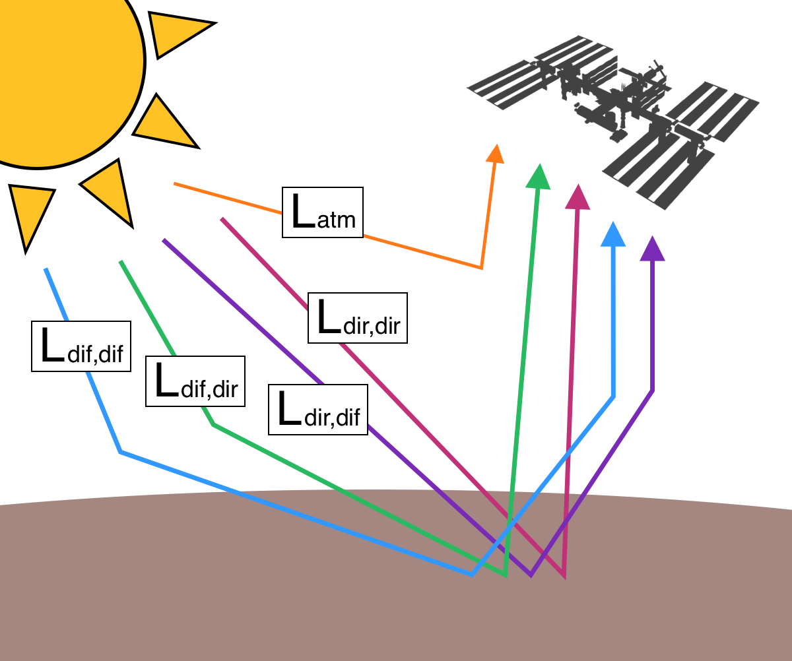

*Figure 4: The atmospheric correction process involves jointly estimating the parameters of a model that includes the surface reflectance, the atmospheric constituents, and the instrument. We use a six component forward model that models radiance as a sum of photon paths that 1) are scattered by the atmosphere into the sensor line of sight without interacting with the surface ($L_{atm}$), 2) photons that are directly transimtted from sun, to surface, and back to sensor without additional scattering events ($L_{dir,dir}$), 3) and 4) photons that are directly transmitted either upwards or downwards, reflect off of the imaged surface, but are scattered by the atmosphere in the complimentary direction ($L_{dir,dif}$ and $L_{dif,dir}$), 5) photons that are scattered by the atmosphere in both upward and downward directions enroute from sun-surface-sensor ($L_{dif,dir}$), and finally 6) photon paths that ungergo multiple successive scattering between surface and atmosphere (not shown).*

Radiance and spherical albedo terms in equation 1 are related to the physical properties in the atmosphere. Of special interest are the scattering and absorption by molecular gases and aerosols (Figure 4), which all contribute to each of the terms in equation 1. An example of the radiance contribution from gas absorption and aerosol scattering appears in Figure 5 below. EMIT atmospheric correction includes three free parameters within the joint statevector, estimates of column precipitable water vapor, $H_2O$ ($\frac{g}{cm^2}$), a proxy for atmospheric carbon dioxide concentration, $CO_2 (ppm)$, and aerosol optical depth, $AOD$. Each variable contributes to atmospheric radiance profiles, reflecting the depth of absorption features and the overall spectral shape (e.g. Figure 5). It's important to note that the $CO_2$ solution is a crude proxy used to remove artifacts in surface reflectance solutions and should not be used as an accurate estimate of atmospheric $CO_2$ concentration.

    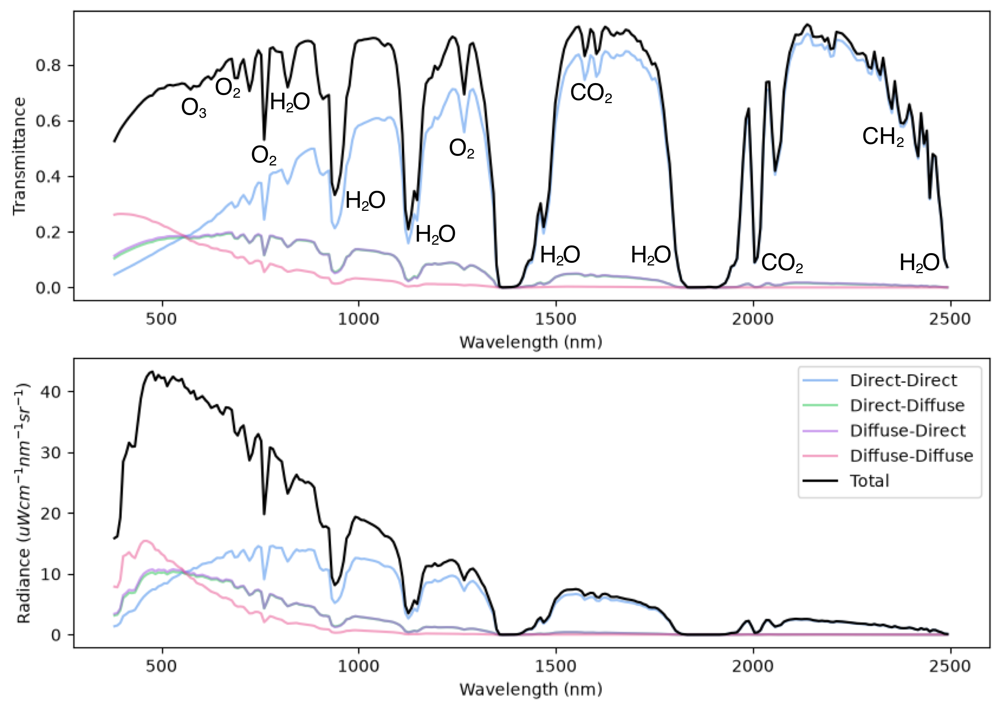

*Figure 5: (top) Atmospheric transmittance by wavelength across the EMIT spectral interval annotated with strong atmospheric absorption features. Black line shows the total transmittance, while colors show the four separated coupled upward-downward direct-diffuse transmittance. (bottom) Atmospheric radiance converted from the transmittance of the top plot. The AC pipeline tracks everything in radiance units rather than transmittance.*

Computationally, calculating atmospheric radiance profiles at run-time for a set of atmospheric variables is prohibitively expensive. Instead, we pre-compute global look-up tables (LUTs) of atmospheric profiles ($L_{atm}, L_{dir,dir}, L_{dif,dir}, L_{dir,dif}, L_{dif,dif}, S$). Global LUTS are constructed at fixed grid points, which covers increments over instrument and solar variables (solar zenith angle, sensor zenith angle, their relative azimuth, and surface elevation) **CHECK: add full range** and encompasses the true range of EMIT collection conditions. LUT dimensions also include grid points of the three atmospheric variables. The AOD grid ranges between roughly 0.05, the MODTRAN 6.0 minimum allowable AOD550, and 0.9. $CO_2$ ranges between 380 and 440 ppm. $H_2O$ ranges between 0.2 and roughly 5.4 $\frac{g}{cm^2}$, the MODTRAN 6.0 maximum allowable column precipitable water vapor.

We generate the EMIT global LUT using an updated, and retrained version of the sRTMnet neural network emulator (Brodrick et al., 2021). Broadly, sRTMnet is trained to emulate the MODTRAN 6.0 Radiative Transfer Model (Berk et al., 2016; 2016b). Specifically, sRTMnet accurately emulates the MODTRAN 6.0 atmospheric gas absorption model, which uses a "correlated k" approach with absorption coefficients from the HITRAN 2012 line list (Rothman et al., 2012). Following prior work, we augment the basic configuration with a sulfate-derived set of aerosol optical properties (Thompson et al., 2019b). The sulfate-based properties have been demonstrated to work effectively across many different domains, including arid environments (Thompson et al., 2020). The aerosol model assumes spherical particles, and is described by spectral absorption, extinction, and asymmetry profiles in prior work (See Figure 6, adapted from Thompson et al., 2019c). Figure 6 compares our selected aerosol's optical properties to those of other types in the literature. type A is a strongly absorbing aerosol signature derived from soot. Type B is a separate signature based on continental dust absorption and scattering coefficients. Type C is the EMIT aerosol, a small scattering particle based on a sulfate signature.

Given a specific solar, instrument, surface, and atmospheric state, sRTMnet Version 2 (V2) estimates all six required atmospheric profiles at high (0.1 nm) spectral resolution. The input data for each sRTMnet grid-point prediction is a 6S radiative transfer simulation (Vermote et al., 1997) with input parameters matching the grid-point state, and can be performed rapidly at 2.5 nm spectral resolution. The 6S source code, has been updated by this team to report the six necessary atmospheric profiles for input into sRTMnet V2 (found at: https://github.com/isofit/6S). The output of the emulator are 0.1 nm spectral resolution vectors for the six atmospheric profiles ($L_{atm}, L_{dir,dir}, L_{dir,dif}, L_{dif,dir}, L_{dif,dif}$, and $S$).

    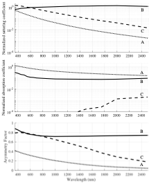

*Figure 6: Aerosol profiles (image and approach adapted from Thompson et al., 2019c), comparing three different aerosol types. Type A is a strongly absorbing aerosol signature derived from soot. Type B is a separate signature based on continental dust absorption and scattering coefficients. Type C is the aerosol used for the EMIT retrievals - a small scattering particle based on a sulfate signature.*

#### 3.3.2 Superpixel Segmentation

A full per-pixel implementation of the iterative OE retrieval is computationally intractable. Our two-stage estimation is designed in part, to address this computational limitation. In the first stage, we run the full OE retrieval on a representative subset of several thousand spectra per scene, i.e., the "superpixels". We segment the full scene into superpixels using an algorithm based on simple linear iterative clustering (SLIC) (Achanta et al., 2012).

First, all spectra in the input radiance file are reduced to a basis of five orthogonal dimensions with principal components analysis. We then segment the 5 dimension basis space into regions that are (a) spatially contiguous and (b) contain several hundred pixels of similar radiance properties. Figure 7 illustrates the superpixel segmentation of an EMIT scene (emit20240419t183331). It results in a reduced subset of locally-representative radiances and associated regions. This dataset is typically 2-3 orders of magnitude faster to analyze. Additionally, it significantly reduces noise variance to assist with accurate atmosphere estimation. For each superpixel we take the mean radiance, location, and observation data as the input to the first atmospheric correction stage.

    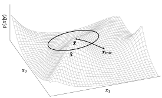

*Figure 7: SLIC segmentation combines contiguous pixels of similar radiance properties into a single local reference area and associated radiance spectrum. (left) Original radiance RGB of Puget Sound. (middle) RGB of SLIC segmented radiance cube with a segmentation size of 40. (right) Blow-up highlight better demonstrating the superpixel scale. Note that superpixels generally follow coastlines and other areas of prominant surface type change.*

#### 3.3.3 OE Model Inversion

Our retrieval algorithm is based on Bayesian Maximum A Posteriori (MAP) inversion of equation 1, using an Optimal Estimation (OE) approach with extensive validation through synthetic and field studies over water, vegetation, snow and bare terrain. (Thompson et al., 2018, 2019b, 2019c). The OE approach allows us to quantitatively propogate uncertainty through the AC process successfully retrieve accurate Lambertian-equivalent surface reflectance in challenging atmospheric conditions. The full formal OE inversion as presented in this section is performed on the scene representative superpixels (3.3.2). The full OE inversion is iterative algorithm, and is computationally prohibitively expensive to run on every pixel of an input radiance cube.

The Bayesian Model inversion acts as a local ascent of the posterior probability density for a state vector x consisting of surface, atmosphere, and instrument parameters (Figure 7). As in Thompson et al. (2018) we initialize the result to a heuristic estimate using a band ratio across water vapor absorption features, and an algebraic inversion of equation (1). Then, an iterative gradient-based Levenberg Marquardt follows the (negative) derivative of the following cost function until converging to a local minimum:

$$\chi^2(\mathbf{x}_r) = \frac{1}{2}(\hat{\mathbf{x}}_L - \mathbf{F}(\mathbf{x}_r) + \mathbf{G}(\mathbf{x}_r))^T \Psi_L^{-1} (\hat{\mathbf{x}}_L - \mathbf{F}(\mathbf{x}_r) + \mathbf{G}(\mathbf{x}_r)) + \frac{1}{2}(\mathbf{x}_r - \mu_r)^T \Sigma_r^{-1} (\mathbf{x}_r - \mu_r) \tag{2}$$

The first term is related to the logarithm of the multivariate data likelihood at the current reflectance, atmosphere, and instrument state vector, $\mathbf{x}_r$. Here $\Psi_L$ is the observation noise that incorporates measurement noise in the radiance measurement $\hat{\mathbf{x}}_L$ as well as any unknowns in the surface atmosphere system that are treated here as random variables. The forward model $\mathbf{F}(\mathbf{x}_r)$ (Equation 1) maps $\mathbf{x}_r$ to the measurement space using Lookup table interpolation of the six optical coefficient vectors (3.3.1). Three empirical residual orthogonal functions (EOFs) are aggregated $\mathbf{G}(\mathbf{x}_r)$ to capture cross-collection systematic error due to small biases in radiative transfer modeling. We calculate $\mathbf{G}(\mathbf{x}_r)$ as a function of the instrument portion of the statevector such that the magnitude of EOF contribution is estimated as part of the full joint solution. The full estimated statevector is:

$$x_r = [\rho_1, \rho_2, ..., \rho_n, AOD_{550}, CO_2, H_2O, \beta_{EOF_1}, \beta_{EOF_2}, \beta_{EOF_3}] $$

where $\rho_1$ through $\rho_n$ are the Lambertian-equivalent surface reflectance at all retrived EMIT wavelengths, $AOD_{550}$ is the aerosol optical depth at 550 nm, $CO_2$ is the proxy carbon dioxide concentration in ppm, $H_2O$ is the column precipitable water vapor in $\frac{g}{cm^2}$, and $EOF_1$, $EOF_2$, and $EOF_3$ are the magnitude contributions of the three EOF functions.

The second term in Equation 2 penalizes departures from a multivariate gaussian prior constructed to match the statevector. The multivariate Gaussian prior is defined by Covariance matrix $\Sigma_r$ and mean $\mu_r$. Atmospheric and instrument prior variance are gernally left broad to avoid estimation bias in their retrievals. The three EOF variables for example, use a broad uninformative prior variance with mean of 0. Atmospheric and instrument variables do not contain off-diagonal elements within $\Sigma_r$, and are defined only by their variance. The surface portion of the prior distribution is loose and heavily regularized. It is based on a collection of multivariate Gaussians. See Thompson et al., (2018, 2019a, 2019b) for selection details. In brief, we construct a limited library of 7 potential surface prior distributions. These include both prior means and covariance matrices with off-diagonal elements. At run-time, we use a Euclidean distance to select the prior library mean that is closest to the initial surface reflectance state. All library spectra and initial reflectance spectrum are L2-normalized for the purposes of calculating these distances and prior distributions so that the comparison matches the shape but not the magnitude of spectra. The only difference with the formulation in these previous studies is that all wavelengths outside critical atmospheric windows are left entirely decorrelated, as in Thompson et al. (2020). This allows instrument noise to enter the reflectance estimate unmodified, and permits highly accurate retrieval of absorption features in mineral bands.

Upon convergence, the linearization of the forward model produces an estimate of the posterior probability density. For $\mathbf{K}_r$ representing Jacobian matrices of partial derivatives, i.e. the instantaneous change in the state vector from a change in the calibrated radiance, the posterior covariance takes the form:

$$\Psi_r = (\mathbf{K}_r^T \Psi_L^{-1} \mathbf{K}_r + \Sigma_r^{-1})^{-1}$$

This yields a reflectance, atmosphere, instrument and uncertainty estimates for each reference superpixel spectrum.

    

*Figure 8: The Bayesian model inversion begins at an initial guess, and climbs the local gradient of the posterior probability density (equivalently, minimizing the cost function in equation 2). At the time of convergence, this produces a linearized estimate of posterior uncertainty, portrayed here as an ellipsoid.*

#### 3.3.4 Analytical Line extrapolation

To get from superpixel to individual inversions, we first extrapolate the solved atmospheric field using a local linear model with small amounts of (spatial) gaussian smoothing. This crudely approximates a Gaussian Process Regression for atmospheric extrapolation (as in Eckert et al., 2024), in a robust and computationally efficient manner. The extrapolated atmosphere is then used in an iterative approach to solve for the surface reflectance. Functionally, this iteration converges in a single step. The process is shown in detail in the utility function https://github.com/isofit/isofit/blob/dev/isofit/utils/analytical_line.py.

    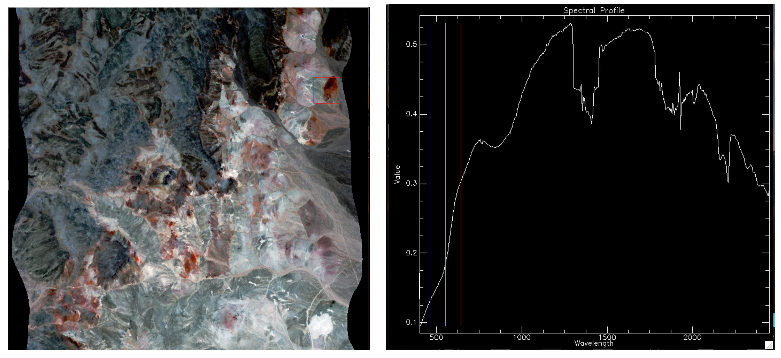

*Figure 9: (Left) Cuprite, NV scene. (Right) Interpolated OE estimation of a single reflectance spectrum, via the local empirical line solution. Sharp, spectrally-diagnostic Kaolinite features are visible in the 2-2.5 micron range.*

#### 4.2.6 Data Masks

Cloud mask link: https://github.com/emit-sds/emit-sds-masks/blob/develop/docs/EMIT_L2A_Mask_ATBD.md

EMIT provides several other mask channels that identify features which should be excluded from the analysis. Water is recognized by its high absorption in near and shortwave infrared wavelengths. We label as water any spectrum with a top of atmosphere reflectance value of less than 0.05 at 1000 nm. We also exclude spacecraft or space station components that intersect the EMIT field of view. These are recognized from their lack of atmospheric features – specifically, the oxygen A band at 760 nm. Simulations suggest that, for a clear cloud-free view of the surface, the A band should have a transmittance that is 80% or less. This is true even for the shortest photon path lengths, which occur under high aerosol loading and high ground elevations. Consequently, we mask any spectrum for which the top of atmosphere reflectance at 762, the absorption peak, is greater than 80% of the value at 780 nm, the continuum outside the A band. Finally, we also mask dense cirrus clouds by thresholding the 1380 nm band as in Gao et al., (1993).

### 4.3 Practical Considerations

Due to the computationally-demanding nature of the EMIT L2A stage, operators must attend to the balance between accuracy and speed in their settings for approximations like the lookup table grid spacing (which affects the number of MODTRAN runs) and the number of superpixels (which affects the accuracy of empirical line extrapolation). Currently, a three- or four-point Aerosol AOD model is used, with linear interpolation between. The H2O model uses a 0.2 g/cm2 spacing. As computational resources permit, these numbers will be relaxed. As of the writing of this document, a typical airborne flightline requires 1-2 days to complete for a single CPU; given a cluster with many CPUs, keeping up with the EMIT datastream is feasible. However, we anticipate further accuracy improvements as additional CPUs come online.

---

## 5. Output Data

The EMIT output data products delivered to the DAAC use their formatting conventions, the system operates internally on data products stored as binary data cubes with detached human-readable ASCII header files. The precise formatting convention adheres to the ENVI standard, accessible (Jan 2020) at https://www.harrisgeospatial.com/docs/ENVIHeaderFiles.html. The header files all consist of data fields in equals-sign-separated pairs, and describe the layout of the file. The specific output files from the L2b stage are:

**I. A surface reflectance file**, typically with the string "rfl" in the filename, containing the estimated spectral surface reflectance for every pixel. It is provided in the non-orthorectified instrument coordinate system with size [rows x cols x channels] in Band-Interleaved by Line (BIL) format and single-precision IEEE little-endian floating point representation. It should overlay the radiance data exactly so that all of the pixels are associated between the two files.

**II. A reflectance uncertainty file**, typically with the string "uncert" in the filename, containing predicted uncertainty in the reflectance measurement for each channel, in units of standard deviations (presuming a Gaussian distribution). Covariance is ignored. It is provide in the non-orthorectified instrument coordinate system with size [rows x cols x channels] in Band-Interleaved by Line (BIL) format and single-precision IEEE little-endian floating point representation. It should overlay the reflectance and radiance data exactly.

**III. A mask file**, typically with the string "mask" in the filename, containing channels with the following information:

1. Cloud flag
2. Cirrus flag
3. Standing water flag
4. Flag for surfaces outside the atmosphere (i.e. a spacecraft or station component)
5. Dilated cloud mask
6. Aerosol Optical Depth (550 nm)
7. Estimated Columnar Water Vapor (g cm-2)
8. Aggregate bad data flag

The eighth channel applies EMIT's masking rules to the other channels in order to determine whether that pixel will be used in subsequent aggregation to the Level 3 product. The file has with size [rows x cols x channels] in Band-Interleaved by Line (BIL) format and single-precision IEEE little-endian floating point representation. It should overlay the reflectance and radiance data exactly.

Any file can contain "bad data" as a result of cloud masking or instrument error. These pixels are typically assigned the reserved (floating point) value -9999. Table 2 Below enumerates all products.

| Output file | Format | Interpretation |
|-------------|--------|----------------|
| Reflectance | rows x columns x channels, BIL interleave 32-bit floating point with detached ASCII header | Lambertian-equivalent surface reflectance |
| Uncertainty | rows x columns x channels, BIL interleave 32-bit floating point with detached ASCII header | Reflectance uncertainty (one standard deviation) |
| Mask | rows x columns x 5, BIL interleave 32-bit unsigned integer, detached ASCII header | Varies by channel (see above). |

*Table 3: Output files*

---

## 6. Calibration, Validation, and Field Measurement

Level 2 reflectances will be validated using standard field protocols used in prior field studies (Thompson et al., 2018, 2019a, 2019b, 2020a). We will measure surface reflectance of a large uniform bright surface, such as a playa, using field spectroradiometers, with coincident in-situ AEROSOL optical depth estimation by sun extinction measurements from the ground, during the EMIT overflight. Instrument measurement and spatial variability, combined with uncertainties in the atmospheric model and retrieval, can demonstrate closed uncertainty budgets as in Thompson et al. (2020a) or simply good agreement between the estimate and reality, as in Thompson et al. (2018). Figure 15 below shows examples of a calibration/validation experiment at Stonewall Playa, Ivanpah, with the spectroradiometer field unit (left panel), the playa itself (center panel), and the comparison of reflectances (right panel). Our calibration and validation plan includes several locations that we will use opportunistically in response to ISS overpasses.

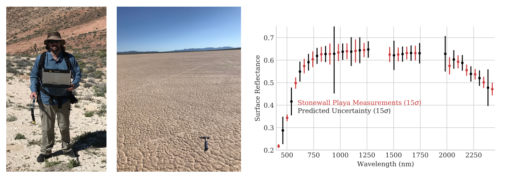

*Figure 15: Left: Field spectroradiometer for validation. Center: Stonewall Playa validation site. Nimrod Carmon demonstrating. Right: Remote and in-situ retrievals with 1σ uncertainty predictions (Thompson et al., 2020).*

Prior verification and validation for the Level 2 algorithm takes several approaches. The codebase is available as open source (ISOFIT, 2019) and has a growing community of users in the research community. The method draws from decades of atmospheric sounding research (Rogers 2000) and its specific application to imaging spectroscopy has been vetted for multiple instruments and campaigns across continents, compared with in situ data and published in peer reviewed literature. Publications referencing the results of this code on airborne precursor data include work by Thompson et al. (2018, 2019b, 2019c), Frouin et al. (2019), and Bue et al. (2019). Field trials demonstrate good alignment with in-situ reflectance data, and residuals consistent with posterior error predictions. Figure 16 shows one example from Ivanpah Playa, conducted in 2018.

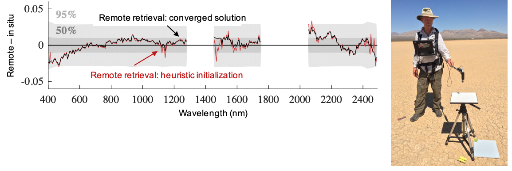

*Figure 16: In situ validation of reflectance estimation algorithm. (Above) In situ and remote measurements align to within posterior error predictions. Adapted from Thompson et al. (2018). (Right) Field validation at Ivanpah Playa, from Thompson et al (2019). Panels show the Ivanpah reflectance residual (Remote − in situ estimate) and the Green Artificial Turf reflectance residual, comparing the initial heuristic retrieval solution and the converged posterior solution against 50% and 95% bounds across wavelength (400–2400 nm).*

AOD estimates show good alignment with spatiotemporally-proximal MODIS retrievals over difficult hazy conditions, and with in-situ estimates by handheld sunphotometers (Figure 17).

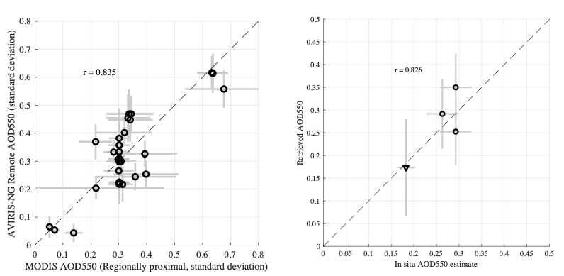

*Figure 17: (Left) MODIS AOD550 estimates align with remote airborne retrievals acquired on the same day within a latitude/longitude degree (r = 0.835). (Right) Airborne retrievals align with in-situ sunphotometry (r = 0.826). Both images are from Thompson et al. (2019c).*

For the EMIT mission we performed a separate sensitivity study to determine the degree to which aerosol type mismatch during atmospheric correction could impact surface mineralogy estimates. Specifically, we examine a mismatch between the template aerosol profiles in the EMIT surface/atmosphere retrieval process and the "true" optical properties of aerosols in the atmosphere. It is likely that the optical properties in the retrieval and atmosphere never match exactly; templates are intended as generic flavors of distortion that the inversion can mix in proportions to achieve good quality inversions. It is reasonable to ask whether an unforeseen optical type, not captured by the combinations of palette options, could induce an erroneous residual shape in the surface reflectance. Most damaging would be an absorbing aerosol that bears its own minerals inducing some hallucinatory mineral-like change in the surface reflectance. Such situations would not be common in practice, though mineral absorption profiles are occasionally visible in dust plumes imaged historically by spectrometers under extreme conditions (Chudnovsky et al., 2009).

Our experiment uses an atmosphere based on the iron-oxide-bearing dust mineral profile in the CAM earth system model. This is a strongly absorbing aerosol with shapes distinctly different from the profile palette in our inversion. Notably, the shapes of optical absorptions by atmospheric dust also differ significantly from the surface minerals. They are also somewhat muted in their airborne dust form due to embedding within larger particles. As a consequence, we hypothesize that a band depth estimate of hematite absorption surface signatures should not be significantly affected by any surface reflectance error from this mismatch. To test this, we simulate a stressing case in which the instrument observes a hematite absorption feature, with and without an additional perturbation at 2% relative band depth. This level of sensitivity is the detection limit targeted by EMIT. Our reference atmosphere presumes typical ISS viewing geometry, but under very hazy conditions. The AOD550 is fixed at our mission-level acceptance threshold 0.4, beyond which a "bad data" flag would be triggered. Figure 18 shows the optical properties of the ESM iron oxide aerosol, given as spectral absorption and single scattering albedo efficiencies for a total extinction normalized to unity at 550 nm.

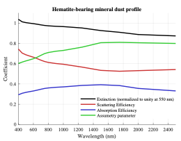

*Figure 18: Dust optical properties for the iron oxide profiles used in the CAM ESM model. The aerosol absorption profile, in blue, contains subtle iron oxide absorption features but these atmospheric signatures are muted relative to the (stark) mineralogical features visible at the surface. Curves show extinction (normalized to unity at 550 nm), scattering efficiency, absorption efficiency, and asymmetry parameter across 400–2400 nm.*

We calculate the continuum-relative surface reflectance absorption from the USGS spectral library version 7.0. We performed forward prediction of TOA radiances via the MODTRAN RTM, added relevant instrument noise calculated via Current Best Estimate (CBE) instrument models, and finally inverted the result with our standard atmospheric correction algorithm. For each result, we estimated the reflectance of the unperturbed and perturbed case, with the ratio of the two showing the estimated relative difference in hematite. The resulting relative absorptions appear in Figure 19 below. Note that the unexpected distortion of H2O vapor features induces some structured error near those windows at 940 and 1140 nm. However, the overall depth and shape of the critical hematite absorption is not significantly affected. This is also apparent in the resulting band depth estimate vis a vis the interpolated continuum, which differs by a small percent of the surface reflectance - 19.626% vs 19.608% for the undistorted case. In other words, small perturbations of the background, recognized using spectral shapes based on relative radiometry (the EMIT strategy), are not significantly distorted. The relative difference of <0.1% would not endanger the ability to detect the addition of hematite to the surface at 2% areal fractional occurrence, and would not affect the mineralogy estimates to a level that would endanger mission success.

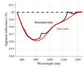

*Figure 19: The result of atmospheric simulation and inversion under mismatched aerosol optical types, retrieving an iron oxide mineral signature under an iron-oxide-bearing aerosol. The unexpected distortion of H2O vapor features induces some structured error near those absorptions at 940 and 1140 nm. However, the overall depth and shape of the critical hematite absorption feature is not significantly affected. Estimated and true apparent reflectance ratios (%) are compared across 800–1200 nm.*

---

## 7. Constraints and Limitations

Two main caveats on the atmospheric correction bear emphasis. First is the challenge of generalizing performance guarantees past the nominal range of observing conditions. The EMIT mission uses conservative values to create masks and acquisition plans to exclude poor observing conditions that would spoil atmospheric correction model assumptions and/or accuracy. These include masking on:

- Total aerosol optical depth at 550 nm (AOD550)
- Solar zenith angle
- Distance to screened clouds.

These thresholds to control the pixels that appear in the mask and enters the level 3 stage. They were designed conservatively to ensure good data quality downstream. However, since all spectra will be made available at the L2A stage alongside the masks, investigators may choose not to apply them and use the "bad" data anyway. We caution the investigators that such atmospheric and observing regimes are outside the bounds of our modeling and analysis, and our performance assessments cannot apply in those cases.

A second important caveat, noted above, is that the main purpose of the level 2A stage is to determine the surface reflectance. Because the values of Aerosol and water vapor retrievals may not be validated against physical standards, we caution against their interpretation as physical parameters of the atmosphere. In particular, it is likely that neither quantity would exactly match direct in-situ observations of similar quantities due to differences in the optical absorption path. But even along the same path, we intend these parameters as a means to correct atmosphere-like distortions in surface reflectance rather than measurement targets in themselves.

---

## 8. Code Repository and References

### 8.1 Repository

The EMIT L2a code is based on the ISOFIT codebase, open source under the Apache 2.0 license and available at the following URL:

> https://github.com/isofit/isofit

Tutorial materials on the atmospheric correction process and code examples are located at:

> https://github.com/davidraythompson/istutor

### 8.2 References

Achanta, R., Shaji, A., Smith, K., Lucchi, A., Fua, P., & Süsstrunk, S. (2012). SLIC superpixels compared to state-of-the-art superpixel methods. *IEEE Transactions on Pattern Analysis and Machine Intelligence*, 34(11), 2274-2282.

Chapman, J., Thompson, D. R., Helmlinger, M. C., Eastwood, M. L., Bue, B. D., Geier, S., Green, R. O., Lundeen, S. R., Olson-Duvall, W. (2019). Spectral and Radiometric Calibration of the Next Generation Airborne Visible Infrared Spectrometer (AVIRIS-NG). *Remote Sensing*, 11(18), 2129.

Chudnovsky, A., E. Ben‐Dor, A. B. Kostinski, and I. Koren. "Mineral content analysis of atmospheric dust using hyperspectral information from space." *Geophysical Research Letters* 36, no. 15 (2009).

Berk, A., et al. (2016). Algorithm Theoretic Basis Document (ATBD) for Next Generation MODTRAN®. Spectral Sciences, Inc.: Burlington, MA, USA.

Berk, A., J. van den Bosch, F. Hawes, T. Perkins, P.F. Conforti, G.P. Anderson, R.G. Kennett, P.K. Acharya (2016b). MODTRAN®6.0.0 User's Manual (revision 5). Spectral Sciences, Inc.: Burlington, MA, USA. SSI-TR-685.

Bernstein, L.S., Adler-Golden, S.M., Sundberg, R.L., Levine, R.Y., Perkins, T.C., Berk, A., Ratkowski, A.J., Felde, G. and Hoke, M.L., (2005). Validation of the QUick Atmospheric Correction (QUAC) algorithm for VNIR-SWIR multi-and hyperspectral imagery. In *Defense and Security* (pp. 668-678). International Society for Optics and Photonics.

Brodrick, P. G., Thompson, D. R., Fahlen, J. E., Eastwood, M. L., Sarture, C. M., Lundeen, S. R., … & Green, R. O. (2021). Generalized radiative transfer emulation for imaging spectroscopy reflectance retrievals. *Remote Sensing of Environment*, 261, 112476.

Brodrick, P.G., A.M. Chlus, N. Bohn, E. Greenberg, J. Montgomery, J.W. Chapman, M. Eastwood, S.R. Lundeen, R. Eckert, W. Olson-Duvall, D.R. Thompson, and R.O. Green. 2026. AVIRIS-5 L2A Orthocorrected Surface Reflectance, Facility Instrument Collection. ORNL DAAC, Oak Ridge, Tennessee, USA.

Bue, B. D., Thompson, D. R., Deshpande, S., Eastwood, M., Green, R. O., Natraj, V., … & Parente, M. (2019). Neural network radiative transfer for imaging spectroscopy. *Atmospheric Measurement Techniques*, 12(4), 2567-2578.

Cardoso, A.W., Hestir, E.L., Slingsby, J.A., Forbes, C.J., Moncrieff, G.R., Turner, W., Skowno, A.L., Nesslage, J., Brodrick, P.G., Gaddis, K.D. and Wilson, A.M.,  (2025). The biodiversity survey of the Cape (BioSCape), integrating remote sensing with biodiversity science. npj Biodiversity, 4(1), 2.

Eckert, R., Mauceri, S., Thompson, D. R., Fahlen, J. E., & Brodrick, P. G. (2024). Spatially constrained atmosphere and surface retrieval for imaging spectroscopy. *Remote Sensing of Environment*, 300, 113902.

Frouin, R. J., Franz, B. A., Ibrahim, A., Knobelspiesse, K., Ahmad, Z., Cairns, B., ... & Huang, X. (2019). Atmospheric correction of satellite ocean-color imagery during the PACE era. *Frontiers in Earth Science*, 7, 145.

Gao, B.-C., Heidebrecht, K. B., & Goetz, A. F. H. (1993). Derivation of scaled surface reflectances from AVIRIS data, *Remote Sensing of Environment*, 44, 165-178.

Gao, B.-C., Goetz, A. F., & Wiscombe, W. J. (1993). Cirrus cloud detection from airborne imaging spectrometer data using the 1.38 µm water vapor band. *Geophysical Research Letters*, 20(4), 301-304.

Gao, B.-C., Montes, M. J., Davis, C. O., and Goetz, A. F. (2009). Atmospheric correction algorithms for hyperspectral remote sensing data of land and ocean. *Remote Sensing of Environment*, 113, S17-S24.

ISOFIT: Imaging Spectrometer Optimal FITting. (2019) Public, open source repository available for view, download, comment and contributions. http://github.com/isofit/isofit/

Kruse, F. A. (1988). Use of airborne imaging spectrometer data to map minerals associated with hydrothermally altered rocks in the northern Grapevine Mountains, Nevada and California. *Remote Sensing of Environment*, 24, pp. 31–51.

Kruse, F. A. (2004). Comparison of ATREM, ACORN, and FLAASH atmospheric corrections using low-altitude AVIRIS data of Boulder, CO. In *Summaries of 13th JPL Airborne Geoscience Workshop*, Jet Propulsion Laboratory, Pasadena, CA.

Moran, M.S., Bryant, R., Thome, K., Ni, W., Nouvellon, Y., Gonzalez-Dugo, M.P., Qi, J. and Clarke, T.R., (2001). A refined empirical line approach for reflectance factor retrieval from Landsat-5 TM and Landsat-7 ETM+. *Remote Sensing of Environment*, 78(1-2), pp.71-82.

Perkins, T., Adler-Golden, S., Matthew, M. W., Berk, A., Bernstein, L. S. Lee, J. and Fox, M., (2012). "Speed and accuracy improvements in FLAASH atmospheric correction of hyperspectral imagery", *Opt. Engineering*, Vol. 51, 111707-1 -111707-7.

Reinersman, P. N., K.L. Carder, R.F. Chen, (1998). Satellite-sensor calibration verification with the cloud-shadow method. *Applied Optics*, 37, pp. 5541–5549

Richter, R., & Schlaepfer, D. (2002). Geo-atmospheric processing of airborne imaging spectrometry data, Part 2: atmospheric/topographic correction, *International Journal of Remote Sensing*, 23(13), 2631-2649.

Roberts, D. A., Yamaguchi, Y., & Lyon, R. (1986). Comparison of various techniques for calibration of AIS data, in *Proceedings of the 2nd Airborne Imaging Spectrometer Data Analysis Workshop* (G. Vane and A. F. H. Goetz, Eds.), JPL Publication 86-35, 21-30, Jet Propulsion Lab, Pasadena, CA.

Rodgers, C. D. (2000). *Inverse Methods for Atmospheric Sounding: Theory and Practice*. World Scientific.

Rothman, L. S. (2010). The evolution and impact of the HITRAN molecular spectroscopic database. *Journal of Quantitative Spectroscopy and Radiative Transfer*, 111(11), 1565-1567.

Thompson, D. R., Green, R. O., Keymeulen, D., Lundeen, S. K., Mouradi, Y., Nunes, D. C., Castaño, R. & Chien, S. A. (2014). Rapid spectral cloud screening onboard aircraft and spacecraft. *IEEE Transactions on Geoscience and Remote Sensing*, 52(11), 6779-6792.

Thompson, D. R., Gao, B. C., Green, R. O., Roberts, D. A., Dennison, P. E., & Lundeen, S. R. (2015). Atmospheric correction for global mapping spectroscopy: ATREM advances for the HyspIRI preparatory campaign. *Remote Sensing of Environment*, 167, 64-77.

Thompson, D. R., Natraj, V., Green, R. O., Helmlinger, M. C., Gao, B. C., & Eastwood, M. L. (2018). Optimal estimation for imaging spectrometer atmospheric correction. *Remote Sensing of Environment*, 216, 355-373.

Thompson, D. R., Guanter, L., Berk, A., Gao, B. C., Richter, R., Schläpfer, D., & Thome, K. J. (2019). Retrieval of atmospheric parameters and surface reflectance from visible and shortwave infrared imaging spectroscopy data. *Surveys in Geophysics*, 40(3), 333-360.

Thompson, D. R., Cawse-Nicholson, K., Erickson, Z., Fichot, C. G., Frankenberg, C., Gao, B. C., ... & Thompson, A. (2019b). A unified approach to estimate land and water reflectances with uncertainties for coastal imaging spectroscopy. *Remote Sensing of Environment*, 231, 111198.

Thompson, D. R., Babu, K. N., Braverman, A. J., Eastwood, M. L., Green, R. O., Hobbs, J. M., ... & Mathur, A. (2019c). Optimal estimation of spectral surface reflectance in challenging atmospheres. *Remote Sensing of Environment*, 232, 111258.

Thompson, D. R., Braverman, A., Brodrick, P. G., Candela, A., Carmon, N., Clark, R. N., ... & Wettergreen, D. S. (2020). Quantifying uncertainty for remote spectroscopy of surface composition. *Remote Sensing of Environment*, 247, 111898.

Thompson, D. R., D. Blaney, N. Bowles, B. H. Ehlmann, A. Fraeman, R. O. Green, R. Greenberger, R. Klima, Pantazis Mouralis, M. Sandford, C. Pieters, W. Williamson (2020b). On the information content of remote imaging spectroscopy for quantifying lunar water. Manuscript in preparation.

Thompson, D.R., D.J. Jensen, J.W. Chapman, M. Simard, and E. Greenberg. 2023. Delta-X: AVIRIS-NG L2B BRDF-Adjusted Surface Reflectance, MRD, LA, 2021, V2. ORNL DAAC, Oak Ridge, Tennessee, USA.
