# Earth surface Mineral dust source InvesTigation (EMIT)

## EMIT L2A: Surface Reflectance

### Version 1 to Version 2 Transition Document

David R. Thompson1, Philip G. Brodrick1, Robert O. Green1, Olga Kalashnikova1, Sarah Lundeen1, Gregory Okin2, Winston Olson-Duvall1, Thomas Painter2

1 Jet Propulsion Laboratory, California Institute of Technology

2 University of California, Los Angeles

Version 2.0
August 2026

Jet Propulsion Laboratory
California Institute of Technology
Pasadena, California 91109-8099

## Table of Contents
1. [Updates to Level 2A reflectance between Version 1 and Version 2](#1-reflectance-comparison)
2. [Summary of changes](#2-summary-of-changes)
    - 2.1. [Updated Radiative Transfer Formalism (Forward Model)](#21-updated-forward-model)
    - 2.2. [Updated Radiative Transfer Model](#22-updated-radiative-transfer-model)
    - 2.3. [Empirical orthogonal functions (EOFs)](#23-empirical-orthogonal-functions)
    - 2.4. [Edited Surface Reflectance Statistical Prior](#24-edited-surface-reflectance-statistical-prior)
    - 2.5. [Variable atmospheric carbon dioxide concentration ($CO_2$)](#25-variable-atmospheric-co2)
    - 2.6. [Constrained Aerosol Optical Depth Prior Variance](#26-constrained-aerosol-optical-depth-prior-variance)
    - 2.7. [Removed pressure elevation from solution state](#27-pressure-elevation)
    - 2.8. [Updated L1B radiometry and wavelength solutions](#28-updated-radiometry-wavelengths)

---

## 1. Updates to Level 2A reflectance between Version 1 and Version 2

Version 2 Level 2A products address minor issues across the spectrum. In general, Version 2 loosens prior constraint in regions of the spectrum with critical mineral absorption features, improves reflectance solutions at visible wavelengths, reduces noise at the edges of deep water vapor features, and minimizes aparrent non-physical absorption features.

#### Insitu comparison of a playa surface

    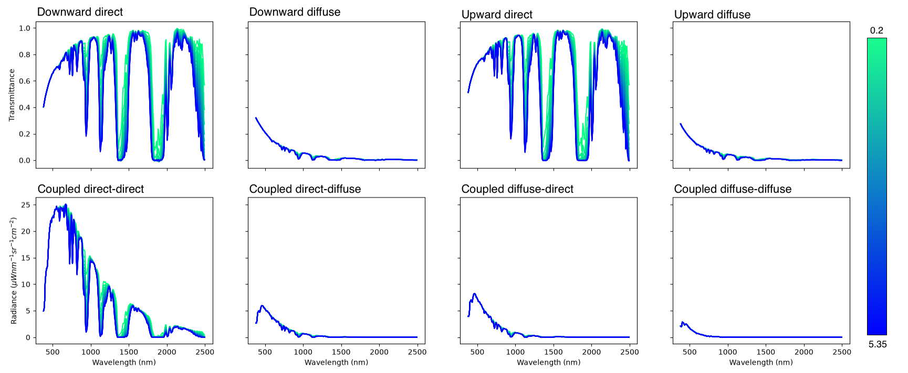

*Figure 1: Version 1 and Version 2 EMIT reflectance compared to in-situ field spectra collected as part of the Gem-X campaign. Several SWIR 2 artifacts are removed in Version 2 data. The arrow points to a prominant feature present in Version 1 that is removed in Version 2.*

#### Comparison of a vegetation spectrum

    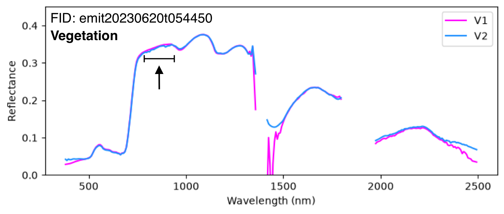

*Figure 2: Example Version 1 and Version 2 EMIT vegetation reflectance. The retrieval uses a surface prior representation from mixed soil-vegetation. The arrow points to the region of the spectrum with looser priors to enable mineral absorption identification.*

#### Comparison of a water spectrum

    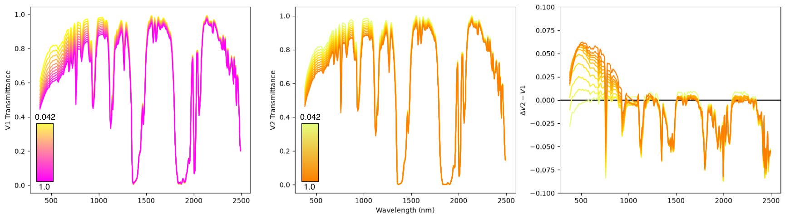

*Figure 3: Example Version 1 and Version 2 EMIT water reflectance. The arrow points to the difference in magnitude at visible wavelengths resulting from the transition between Version 1 sRTMnet and Version 2 sRTMnet.*

#### Comparison of a snow spectrum

    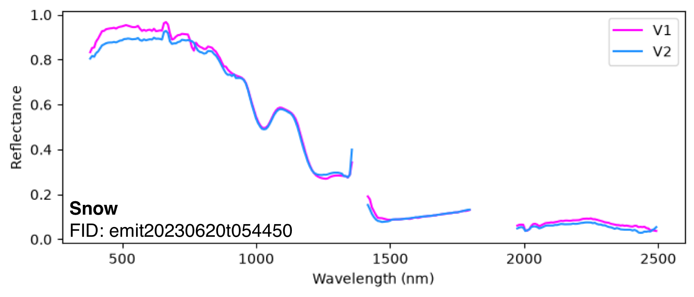

*Figure 4: Example Version 1 and Version 2 EMIT snow reflectance. The difference in reflectance magnitude visible wavelengths is caused by the Version 1 sRTMnet to Version 2 sRTMnet transition.*

#### Loosened NIR surface priors to enable mineral absorption identification

    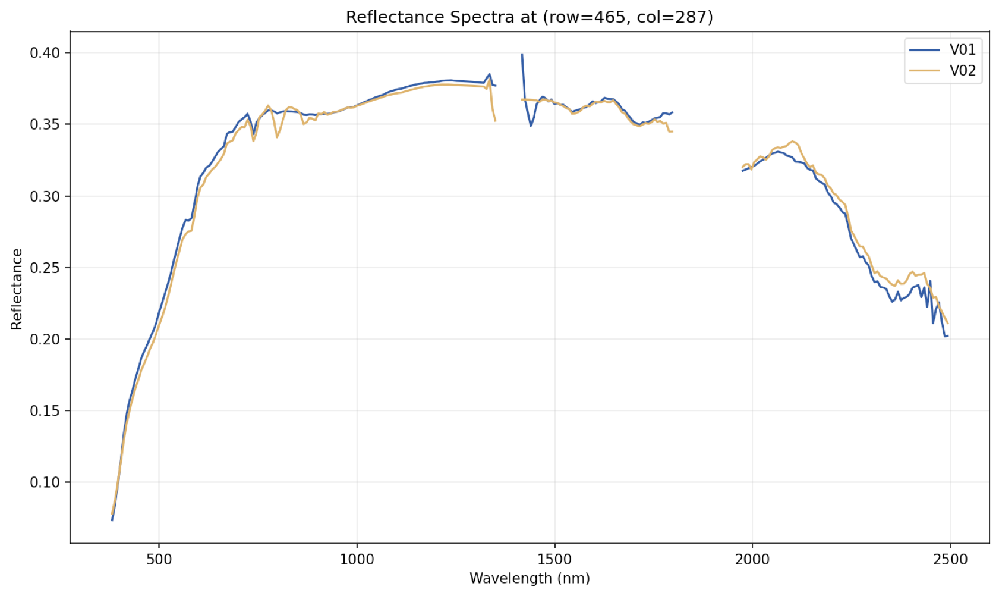

*Figure 5. Example emit spectra with characteristic Neodymium absorption features. Features are more prominent in Version 2 because we loosen prior constraints specifically within this region.*

## 2. Summary of Changes

### 2.7. Updated L1B radiometry and wavelength solutions

### 2.1. Updated Radiative Transfer Formalism (Forward Model) [↑](#table-of-contents)

Version 2 updates the radiative transfer formalism, i.e., the forward model, which quantifies light transfer through the atmosphere and surface. Version 2 leverages a form, which accounts for six distinct photon paths (ATBD Section 3.2.1; Vermote et al., 1997):

$$
L_o = L_{atm} + L_{dir,dir}\rho + \frac{L_{dif,dir}\rho}{1-S\rho} + L_{dir,dif}\rho + \frac{L_{dif,dif}\rho}{1-S\rho} + \frac{L_{tot}S\rho^2}{1-S\rho} \qquad (1)
$$

where $L_o$ is the radiance measured by the instrument, $L_{atm}$ is the atmospheric path radiance, $L_{dir,dir}$, $L_{dif,dir}$, $L_{dir,dif}$, and $L_{dif,dif}$ are the coupled atmospheric radiances, $L_{tot}$ is the total atmospheric radiance, $S$ is the spectral albedo representing the atmospheric reflectance as seen from the surface, and $\rho$ is the Lambertian-equivalent surface reflectance. Each variable is a vector quantity. Multiplication between them represents element-wise multiplication. 

The advantage of the Version 2 forward model is that it allows for better constrained, and more complete physical models of the surface and atmosphere. Surface-specific modeling can leverage split, coupled radiances to explicitely capture directional and hemisphere-related phenomena like water surface glint (Bohn et al., 2025) and adjacency effects (CITATION).

The Version 1 forward model in contrast, is:

$$
L_o = L_{atm} + \frac{L_{tot}\rho}{1 - S\rho} \qquad (2)
$$

In EMIT processing, the practical impact of the forward model difference is the inclusion of an explicit multi-scattering term, $\frac{L_{tot}S\rho^2}{1-S\rho}$. The multi-scattering term captures photon paths that may undergo multiple scattering events between surface and atmosphere before reaching the detector. This term is generally small in magnitude and differences in modeled radiances between including it and not are on the order of 1% (Figure 1).

    

*Figure 2. (**top**) Forward calculations at varying aerosol optical depth (AOT) following the Version 2 forward model (Equation 1; dark lines) and the Version 1 forward model (Equation 2; light lines). All calculations use the same reflectace vector and atmospheric state (H2O = 2.78, CO2 = 409.3). (botttom) Residual difference between forward model calculations following the two equations.*

### 2.2. Updated Radiative Transfer Model (RTM) [↑](#table-of-contents)

The version 2 L2A product uses an updated radiative transfer model to build atmospheric look-up tables (LUTs). Both Versions 1 and 2 use flavors of the sRTMnet emulator (Brodrick et al., 2021) described in section 3.2.2 in the ATBD. The key difference between the model versions is that version 2 of the sRTMnet model (sRTMnet V2) is specifically trained to predict all six components used to compute the required inputs for the Version 2 forward model (Equation 1). 

Version 2 sRTMnet predicts atmospheric path reflectance, $\rho_{atm}$, transmittance of downward-direct photon paths, $t_{down,dir}$, transmittace of downward-diffuse photon paths, $t_{down,dif}$, transmittance of updward-direct photon paths, $t_{up,dir}$, transmittance of upward-diffuse photon paths, $t_{up,dif}$, and the spherical albedo of the atmosphere, $S$ at 0.1 nm spectral resolution. Version 1 sRTMnet  in contrast, predicts $\rho_{atm}$, total atmospheric transmittance, $t_{tot}$, and $S$ at 0.5 nm spectral resolution.

Differences between sRTMnet versions are dependent on the atmospheric state and most prominent in extreme atmospheres (Figure 2 and Figure 3). With respect to aerosol optical depth (AOD) and atmospheric water vapor ($H_2O$), there consistent differences at visible wavelengths and within water absorption feaures reflecting the shape of the dependence between atmospheric transmittance and these two variables.

    

*Figure 7. Modeled total transmittance with (left) version 1 sRTMnet and (middle) version 2 sRTMnet at varying atmosphere water vapor concentration. Comparison is made with constant $AOD = 0.2$. (right) Residual difference between version 2 - version 1.*

    

*Figure 8. Modeled total transmittance with (left) version 1 sRTMnet and (middle) version 2 sRTMnet at varying aerosol optical depth. Comparison is made with constant $H_2O = 0.6$. (right) Residual difference between version 2 - version 1.*

#### Wavelength resampling of atmospheric quantities

Careful consideration of wavelength resampling is required because radiative transfer modeling is performed at a higher spectral resolution than instrument response. This is especially true with the added complexity of coupled atmospheric terms in the updated forward model. Version 2 now performs atmospheric coupling and downstream convolutions on radiance quantiies, rather than transmittance. Look-up table entries are stored in radiance units, which mitigates convolution errors arrising when resampling transmittance quantities.

#### Updated model uncertainty

Reflectance retrieval uses an empirically derived uncertainty model to propogate prediction uncertainties into the downstream Level 2A product. The Version 2 sRTMnet emulator has a new uncertainty model reflecting its updated structure and retrained weights.

    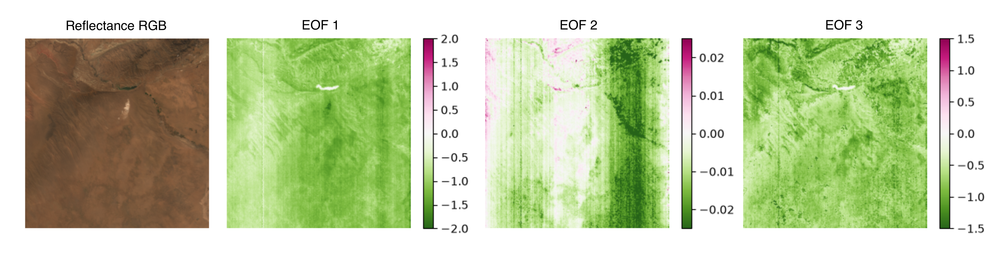

*Figure 9. Standard deviation of the diagonal of the model discrepency matrix for Version 1 and Version 2 sRTMnet.*

### 2.3. Empirical orthogonal functions (EOFs)

Empirical residual orthogonal functions (EOFs) capture systematic cross-cross collection residual error arising from biases in radiative modeling and other unconstrained radiometric factors. Vectors are empirically determined and statically fixed (Figure 10). Visible wavelengths and wavelengths with significant atmospheric water absorption are manually masked out creating the discontinuous appearance of EOF values across the spectrum. 

While the EOF vectors are static, we jointly estimate magnitude scalers on the vectors as part of the full OE inversion following ATBD section 3.2.4. The spatial footprint of these fit EOF magnitudes follow physically reasonable patterns. In the EMIT case, granule columns with known radiometric effects show up prominently in EOF maps (Figure 11). The impact of incorporating the EOFs on retrieved reflectance is limited to wavelengths with non-zero EOF values (Figure 12). Reflectance differences are most noticable at the edges of deep atmospheric water absorption features at shortwave infrared wavelengths.

    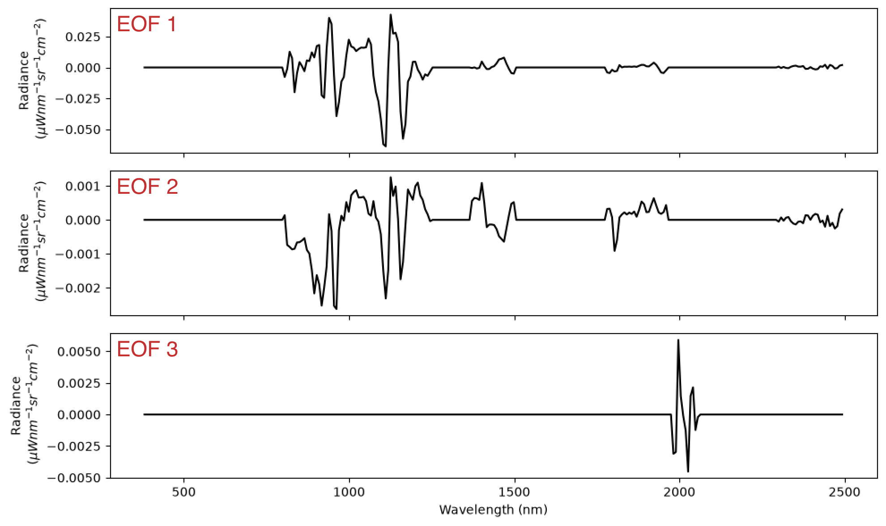

*Figure 10. The Version 2 EOF vectors. Flat regions with 0.0 values are regions of the spectrum that are manually masked out. We only apply the additive EOF correction within "windows of the spectrum".

    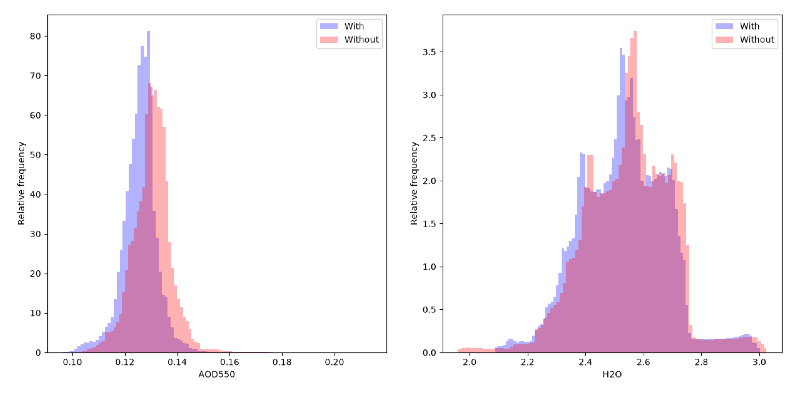

*Figure 11. Spatial maps of jointly estimate EOF magnitudes for the three EOF vectors. The magnitudes shown here are jointly estimated as part of the OE retrieval following section 3.2.4. Striping and column-wise clustering follows known columnar patterns of radiometric effects.*

    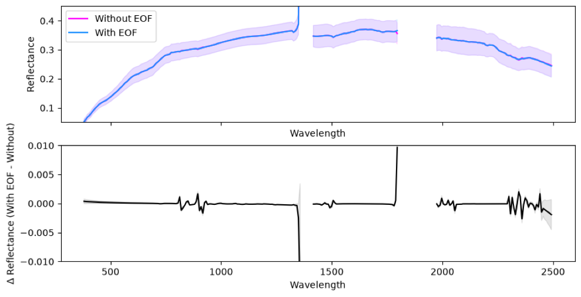

*Figure 12. Example of scene-wide difference in retreived reflectance with and without joint EOF retrievals. Each set of solutions were run with the same Version 2 configuration. The only difference is the inclusion and ommision of EOF fits. The solid lines are the scene-wide means. The shaded areas are +/- 1 standard deviation.*

### 2.4. Edited Surface Reflectance Statistical Prior

Optimal estimation following ATBD section 3.2.4 leverages statistical constraint on surface reflectance where the constraint follows a multivariate prior distribution, $p^{'}(x_r)=\mathcal{N}(\mu_r, \Sigma_r)$, where $\mu_r$ is the prior mean and $\Sigma_r$ is the prior covariance. 

Version 2 alters the prior distribution for all surface types. First, spectra that match the soil category use a different prior mean, specifically tailored to remove mineral absoprition artifacts that can bias retrievals. Second, the structure of prior regularization is more granular, allowing statistical constraints to target narrow wavelength regions. Third prior covariances are manually regularized to provide slightly more constraint at shortwave infrared wavelengths. Fourth, prior covariances at near infrared wavelengths are manually regularized to provide slightly less constraint. The impact of these changes are designed to specifically target the edges of atmospheric deep water absorption regions, and to help identify near-infrared mineral absorption features.

    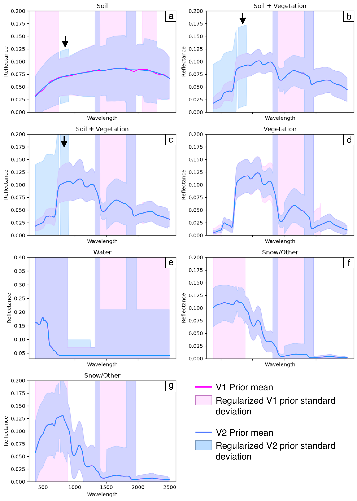

*Figure 13. Version 1 and Version 2 surface prior library means and standard deviations for (a) soil, (b) and (c) soil + vegetation, (d) vegetation, (e) water, (f) Snow/Other, and (g) Snow/Other. The prior mean changed for only one surface type, soil. Prior covariances, demonstrated here as the standard deviation changed for every surface type. Arrows point to the NIR region where prior constrains are loosened to enable mineral identification.*

### 2.5. Variable atmospheric $CO_2$

    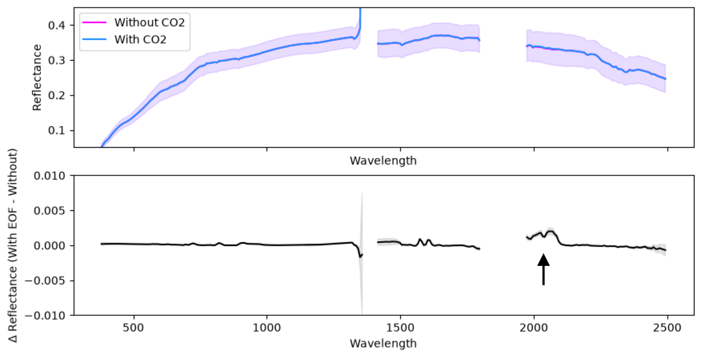

*Figure 13.*

### 2.6. Constrained Aerosol Optical Depth Prior Variance

    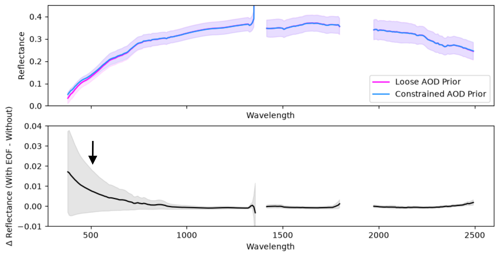

*Figure 15.*

### 2.8. Removed pressure elevation from solution state

    

*Figure 16.*

### 2.9. Edited atmospheric length scales

### 3 References [↑](#table-of-contents)

Vermote, E. F., Tanré, D., Deuze, J. L., Herman, M., & Morcette, J. J. (1997). Second simulation of the satellite signal in the solar spectrum, 6S: An overview. IEEE transactions on geoscience and remote sensing, 35(3), 675-686.
